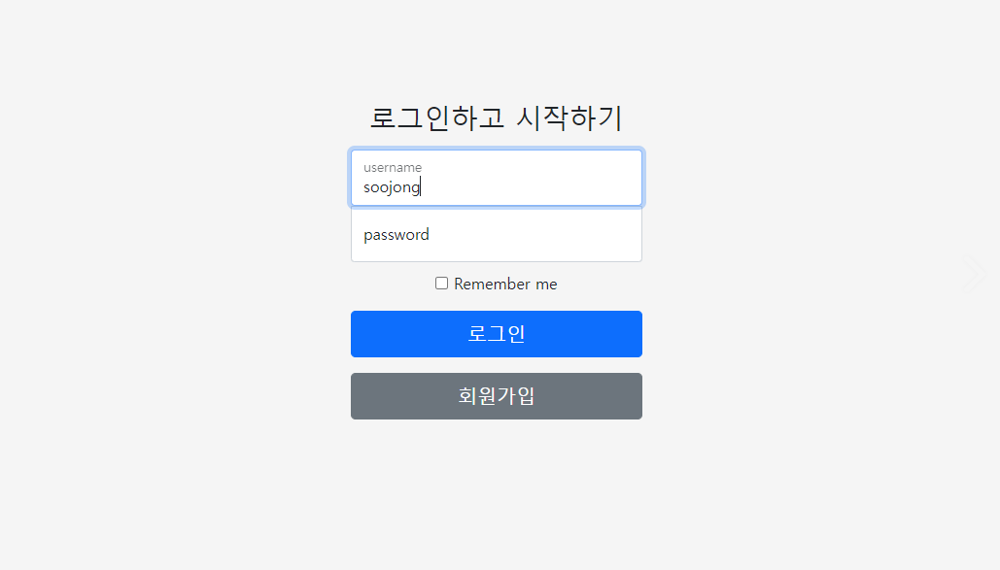
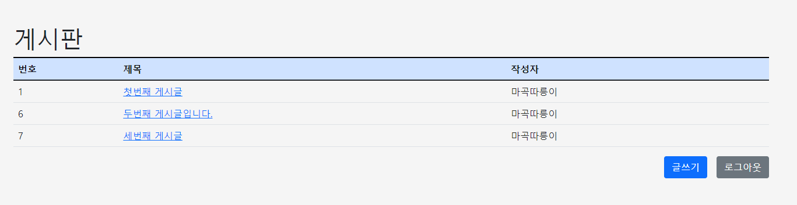
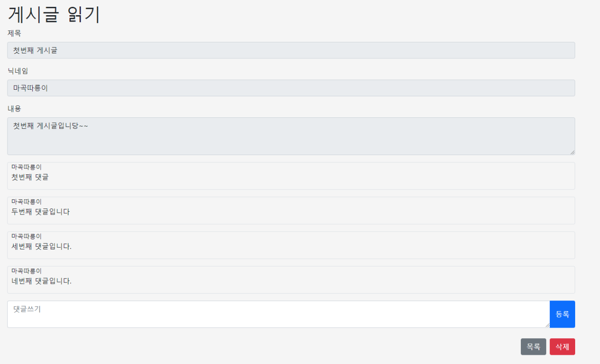

# 소개
- CI/CD 학습을 위한 간단한 게시판 Application입니다.
- Jenkins를 통해 해당 저장소의 Master Branch의 소스코드가 CodeDeploy를 통해 EC2 서버에 배포됩니다.
- 배포 시에는 Docker를 사용하도록 Dockerfile을 작성했습니다.
- Nginx를 리버스 프록시 서버로 활용해서 무중단 배포를 구현했습니다.
- 관련된 상세한 글은 [회고](#회고)에 있는 링크를 참고.

# Demo

# 기능
- 로그인 
- 게시글 작성/삭제
- 댓글 작성/삭제

# Skill Set
## Front-End
- Boostrap
- Javascript/Jquery
- Thymeleaf
## Back-End
- Spring Web MVC
- Spring Security
- Spring Data JPA
- MariaDB
- Junit5
## Deploy
- Jenkins
- Docker
- S3/CodeDeploy
## Infra
- EC2
- Nginx

# 회고
- [게시판 실습 복기 (ft. Spring Security, Junit )](https://soojong.tistory.com/entry/%EA%B2%8C%EC%8B%9C%ED%8C%90-%EC%8B%A4%EC%8A%B5-%EB%B3%B5%EA%B8%B0-ft-Spring-Security-Junit?category=992912)
- [게시판 실습 복기2 (ft. EC2, Jenkins, Codedeploy, S3 )](https://soojong.tistory.com/entry/%EA%B2%8C%EC%8B%9C%ED%8C%90-%EC%8B%A4%EC%8A%B5-%EB%B3%B5%EA%B8%B02-ft-EC2-Jenkins-Codedeploy-S3?category=992912)
- [nginX 무중단 배포 실습](https://soojong.tistory.com/entry/nginX-%EB%AC%B4%EC%A4%91%EB%8B%A8-%EB%B0%B0%ED%8F%AC-%EC%8B%A4%EC%8A%B5?category=992912)
- [Docker로 Spring 애플리케이션 배포하기](https://soojong.tistory.com/entry/Docker%EB%A1%9C-Spring-%EC%95%A0%ED%94%8C%EB%A6%AC%EC%BC%80%EC%9D%B4%EC%85%98-%EB%B0%B0%ED%8F%AC%ED%95%98%EA%B8%B0)
