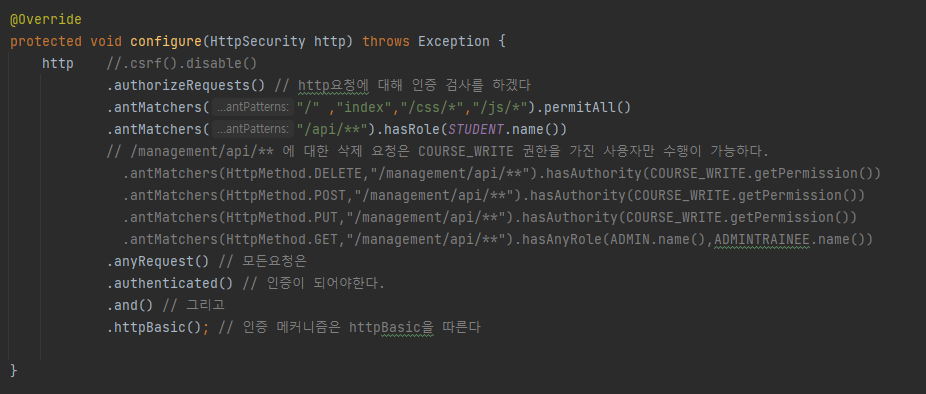
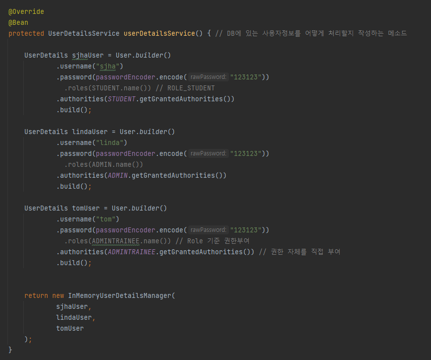
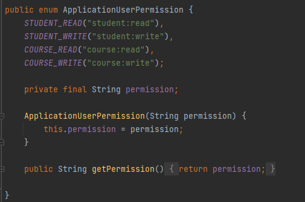
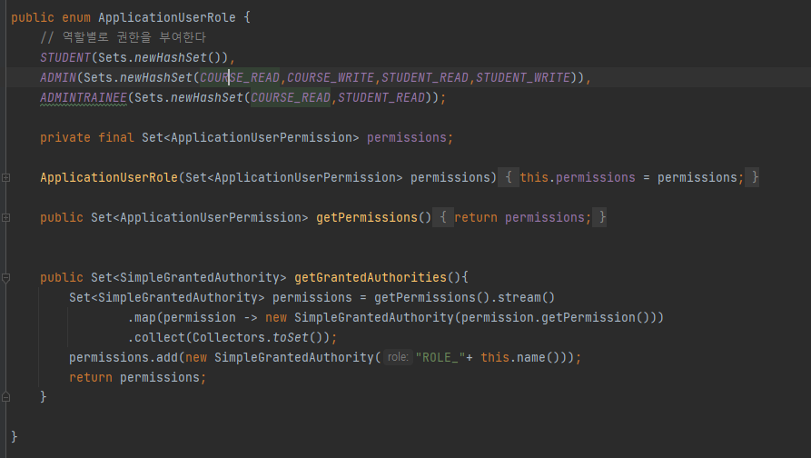

# 적용하기
- `org.springframework.boot:spring-boot-starter-security` 의존성을 추가하면 Spring Security를 사용할 수 있다. 
- 의존성을 추가하기만 해도 로그인을 위한 화면을 제공해준다.
- 서버에 있는 모든 리소스에 대해 인증을 요구하기 때문에 기본으로 제공하는 화면을 쓰는건 현실성이 없다.
- 클래스에 `@EnableWebSecurity`을 적용함으로써 인증을 커스터마이징 할 수있다.

# WebSecurityConfigurerAdapter의 configure
- `WebSecurityConfigurerAdapter` 추상 클래스를 상속함으로써 사용자 요청을 처리할 수 있다.
- `antMatchers`를 통해 리소스를 가져오고 `permitAll()`이나 `hasRole()`등을 호출함으로써 권한이나 역할에 따라 리소스 접근을 제어할 수 있다.

# WebSecurityConfigurerAdapter의 userDetailsService
## InMemory 방식
- `userDetailsService` 메소드의 반환 인스턴스 타입을 `InMemoryUserDetailsManager`로 함으로써 InMemory 사용자 관리가 가능하다.
- ADMIN 같이 변화가 사실상 없는 사용자에 대해선 InMemory로 관리하는게 편하다.

### PasswordEncoder
- passwordEncoder를 통해 입력된 비밀번호를 Encoding을 해야 에러가 발생하지 않는다.
- PasswordEncoder는 인터페이스이며 구현체를 주입받아야하는데 가장 많이 쓰이는것은 `BCryptPasswordEncoder`이다.(`PasswordConfig.java` 참조)

# 권한과 역할
- 역할은 권한의 집합으로 이뤄져있다.
- 리소스 접근시 사용자의 역할 또는 권한을 확인함으로써 접근을 제어할 수 있다.
## 권한(Permission)
- enum타입으로 Permission을 정의한다. 이번 예시에선 STUDENT_READ라는 이름을 바로쓰지 않고, **student:read**와 같이 별도의 String으로 정의한다    

## 역할(Role)
- 역할별로 권한을 부여한다.
- 해당 역할에 대한 권한을 제공할때 GrantedAuthority 인터페이스의 구현체를 제공해야한다.
- `getGrantedAuthorities` 메소드의 마지막 부분에 ROLE도 추가로 넣어서 반환하는데 이부분은 이해가 필요할듯.(추후 학습후 설명 작성)

# EnableGlobalMethodSecurity 어노테이션
- 작성중

# CSRF
## 이론
- Cross-Site Request Forgrey(사이트간 요청 위조)   
- 공격자가 만든 링크를 클릭하는 순간 사용자가 의도하지 않은 요청을 정상 서버에 보냄.
- 예를 들어 사용자가 은행 사이트에 로그인을 하고, 웹서핑 도중 공격 링크를 클릭하는 순간 사용자가 의도하지 않은 요청이 은행 사이트로 갈수 있다. 
- 해결법으로는 정상 사이트에 로그인시 사용자에게 CSRF-Token을 부여하고, 해당 토큰을 가진 요청만 정상으로 간주하고 처리하도록 하면된다.
- CSRF-Token은 난수이므로, 공격자가 패턴으로 유추가 불가능하다.
- [CSRF공격 개념](https://www.osti.gov/servlets/purl/1639993)
- [CSRF공격 대응 방법](https://stackhoarder.com/2019/08/19/laravel-%EA%B8%B0%EB%B3%B8-10-csrf-protection/)

## 실습
- 작성중  

# Basic Auth
- 인증 방식의 일종이며, 사용자가 request를 할때 Header에 `Authorization: Basic xxx` 형태로 셋팅된다.
- 적용이 쉽고 빠르다는 장점이 있지만 로그아웃을 할수 없는 불편함이 있다.
- 로그아웃은 _"더이상 서버의 리소스에 접근이 불가능함"_ 을 말한다.
- `httpBasic()`을 통해 적용이 가능하다.

# Form Based Auth
- 대부분의 웹 사이트의 표준으로 사용중이다.
- 로그인에 성공하면 Cookie에 Session Id를 담아서 Response한다.
- 이후 사용자는 request시에 Session Id를 통해서 서버와 통신한다.
- Session이 만료되면 로그아웃이 된다. ( 더이상 서버의 리소스에 접근이 불가능함. )
- `formLogin()`을 통해 적용이 가능하다.
- 기본적으로 Spring Security에서 Form Based Auth를 위한 화면을 제공해준다.
- 로그인 페이지를 직접 만들고 싶다면 `loginPage` 메소드를 사용하면 된다.

# DB를 통한 사용자 인증
- `WebSecurityConfigurerAdapter`의 `userDetailsService`메소드는 `UserDetailService` 타입을 반환해야한다.
- `UserDetailService`는 인터페이스로서 이전까지는 `InMemoryUserDetailsManager` 구현체를 사용했다.
- 하지만 이번엔 `InMemoryUserDetailsManager`의 또다른 구현체인 `JdbcDaoImpl`를 사용함으로써 DB를 통한 사용자 인증을 수행한다.
